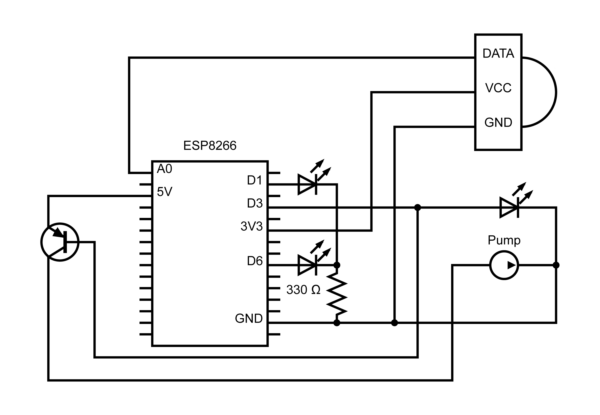

# PII - Plant Irrigation Integration
**Kayseri Üniversitesi Bilgisayar Programcılığı 2. sınıf "Bilgisayarlı Kontrol" dersinin projesidir.**

Nodemcu ESP8266 geliştirme kartı kullanılarak  
çeşitli sensörler ile toprağın nemini takip edip belli bir  
seviyenin altına düştüğünde otomatik sulayan sistem.  

## Kurulum aşaması
MicroPython'u ESP8266 içerisine kurun.  
`./src/wifi_creds.py` dosyası açıp alttaki formatta wifi bilgilerinizi girin.  
```python
WIFI_SSID = "wifi_ismi"
WIFI_PASSWORD = "wifi_sifresi"
```

`config.py` dosyasındaki pin bağlantılarını yapın.  
*(Aynı zamanda bu dosyadan bağlantıları değiştirebilirsiniz)*  

`./src` içerisindeki dosyaları kartın içerisine yükleyin.  
```bash
cd src
ampy -p COM_PORT put main.py
ampy -p COM_PORT put config.py
ampy -p COM_PORT put wifi_creds.py
```

---
Web sitesi için gerekli olan paketleri yükleyin.
```bash
cd ./web-interface
npm install
```

`.env` dosyası açıp içerisine ESP8266'nın ip adresini yazın.
```env
API_URL=192.168.X.X
```
---
## Çalıştırma
ESP8266'yı çalıştırın. Wifi bilgileriniz doğru ise  
üzerindeki LED yanacak ve okuma moduna geçecektir.

Web sitesini çalıştırmak için aşağıdaki komutu çalıştırın.
```bash
cd ./web-interface
npm start
```
Eğer her şey doğru yapıldıysa `http://localhost:3000` adresinden
web sitesine erişebilirsiniz.

---
### Özellikler
* Web sitesi üstünden nem oranını takip edebilme
* Web sitesi üstünden isteğe bağlı sulama yapabilme
* LED'ler ile cihazın durumunu görebilme
* Otomatik sulama

### Görüntüler



### Kullanılan Teknolojiler
* MicroPython (ESP8266) **Embedded**
* NodeJS (Express) **Web**

### Ekip üyeleri
Grup başkanı [Mert Emir](https://github.com/mertemr)
* [Eda Keşoğlu](https://github.com/edakes)
* [Muhammed Nabi Oğuz](https://github.com/muhammed-ogz)
* [Haydar Özgür Mısırlı](https://github.com/Sadre321)
